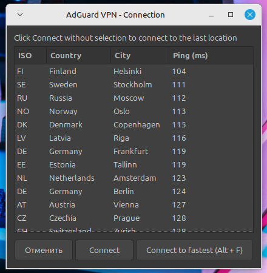

# Xfce4 genmon script for AdGuard VPN CLI

[Xfce4 Generic Monitor Plugin](https://docs.xfce.org/panel-plugins/xfce4-genmon-plugin) script for [AdGuard VPN CLI](https://github.com/AdguardTeam/AdGuardVPNCLI)

- View current status
- Connect & disconnect
- Select location (requires zenity)




## Usage

Use `main.sh` as Command for the [genmon](https://docs.xfce.org/panel-plugins/xfce4-genmon-plugin/start) widget.

Adjust config in `config` file.

### Selecting location

See `LOCATION` variable in config file

### Nopasswd mode

By default, this script will show terminal window when connecting - to allow entering sudo password when prompted.

To use nopasswd mode:
1. Add NOPASSWD record for adguardvpn-cli to the sudoers file:
   ```
   yourusername = NOPASSWD: /path/to/adguardvpn-cli
   ```
   For example:
   ```bash
   echo "$USER ALL = NOPASSWD: /usr/local/bin/adguardvpn-cli" \
     | sudo tee /etc/sudoers.d/adguardvpn \
     && sudo chmod 440 /etc/sudoers.d/adguardvpn
   ```
2. Set `NOPASSWD=1` in `config` file

## Known issues

- Login status is not checked
- Sometimes connection marker file is not deleted (e.g. when connection process is killed).
  You can manually remove `genmon-vpn-status-connecting` file is such cases
